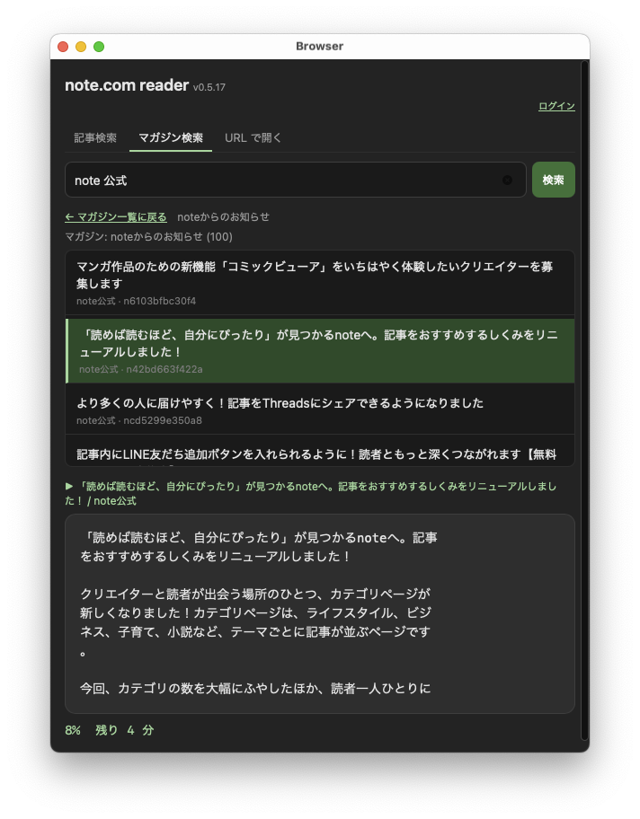
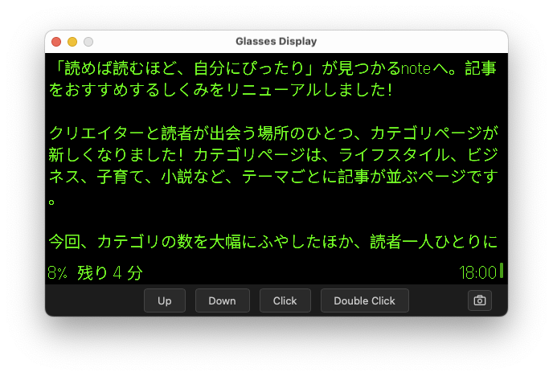

# even-note-com-reader

[日本語版 README はこちら](README-ja.md)

note.com reader for Even Realities G2 smart glasses, built on the Even Hub
SDK. The Even Realities companion app (iOS or Android) loads this WebView
and drives the G2 display over the Even Hub bridge.

| Phone companion | G2 display |
| :---: | :---: |
|  |  |

## Layout

- [`app/`](app/) — Even Hub WebView app (Vite + TypeScript). The phone
  companion UI, and the G2 reader logic that pushes pages to the glasses.
- [`gateway/`](gateway/) — CloudFormation template for a CloudFront
  distribution that acts as a CORS proxy to `note.com`. Required for
  production builds because browsers won't share cookies cross-site to
  `note.com` from a WebView; on iOS WKWebView additionally drops even
  `SameSite=None` third-party cookies entirely.

## Pieces at a glance

```
              ┌──────────────────────────┐
    Phone ─── │ Even Hub WebView (app/)  │ ─── BLE ───▶ Even G2 glasses
              │   - phone companion UI   │
              │   - G2 page renderer     │
              └──────────────┬───────────┘
                             │ HTTPS + Authorization: Bearer <token>
                             ▼
              ┌──────────────────────────┐
              │  CloudFront proxy        │ ── gateway/template.yaml
              │  (note-proxy.yourdomain) │
              │   - CORS headers         │
              │   - Cookie rewrite       │
              │   - Bearer → Cookie      │
              └──────────────┬───────────┘
                             │
                             ▼
                        note.com API
```

## Why the proxy exists

The app hits note.com's private JSON API. A few things make talking to it
straight from a WebView messy:

1. **CORS** — note.com doesn't return CORS headers, so the proxy echoes
   `Origin` back and sets `Access-Control-Allow-Credentials: true`.
2. **Cross-site cookies** — the session cookie note.com sets is
   `SameSite=None; Secure`, but iOS WKWebView still drops it under the
   `.ehpk` WebView's custom scheme. The proxy therefore also exposes the
   session id as an `X-Session-Token` response header; the app reads that,
   stores it, and sends it as `Authorization: Bearer <token>`. The viewer-
   request function translates that back to a `Cookie` before forwarding
   to note.com's origin.
3. **Cookie attributes** — note.com's `Domain=note.com` / `HttpOnly`
   attributes would be rejected by the browser under the proxy's origin;
   the viewer-response function strips them.

## Getting started

1. Stand up the proxy → [`gateway/README.md`](gateway/README.md).
2. Build and install the app → [`app/README.md`](app/README.md).

## Credential handling

- The proxy **does not record credentials**. CloudFront access logs,
  real-time logs, and WAF logging are all disabled in `gateway/template.yaml`;
  neither CloudFront Function emits `console.log`, so nothing about a
  request reaches CloudWatch Logs either. Only the built-in CloudFront
  CloudWatch metrics (request counts, bytes, error rates) are collected,
  and they carry no per-request payload.
- The app sends the user's email and password only as the body of a single
  `POST /api/v1/sessions/sign_in` request. The proxy forwards it straight
  to `note.com` unchanged.
- The "ログイン状態を保持する" opt-in persists `{email, password}` via the
  Even Hub bridge's local storage, which lives inside the Even Realities
  companion app's own sandbox on the phone. Turning the checkbox off on
  login, or hitting Logout, clears it.
- No analytics, telemetry, or third-party beacons. The only outbound
  destination from the app is the proxy origin you configure via
  `VITE_NOTE_PROXY_BASE`.

## License

Apache License 2.0. See [LICENSE](LICENSE).
